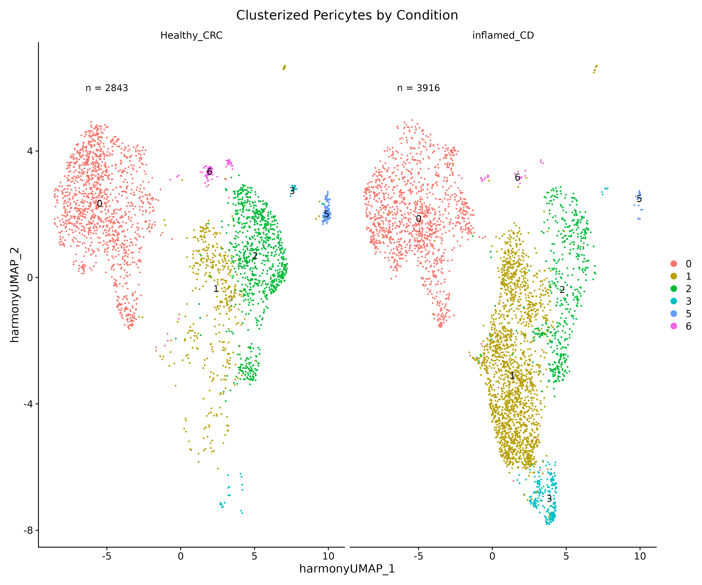

# IBD-Patients-Pericytes-Single-Cell-RNAseq
Single-cell RNA-seq analysis of pericytes from IBD patients and healthy CRC controls (CRC Stage I untreated Patients). Includes QC, Harmony integration, DEG, FGSEA, DCATS, and cell–cell communication to explore biological mechanisms driving inflammation.

Content:

- QC & Filtering: Patient and cell level filtering
- Integration: batch correction using Harmony
- Dimensionality reduction & clustering: PCA, UMAP, MDS
- Differential Expression (DEG): DESeq2-based contrasts between study groups and Pathway Enrichment Analysis (FGSEA)
- DCATS for identifying encriched pericytes subclusters across conditions
- Cell–cell communication: interaction analysis to study inflammatory microenvironment

The objective of this project is to perform a Single Cell RNA seq analysis on pericytes from IBD patients, in order to try to elucidate the rol of this celltype in the complex and intrincated process of Inflammation. 

Data is composed by 44 samples of 32 different patients. These samples are divided in "Inflamed" (Inflammed tissue from IBD patients), "Non Inflamed" (Non Inflamed tissue from IBD patients) and "Healthy". 

## Patient Selection

The dataset had strong batch effect (different sequencing batches, different patients). Also, due to experimental design conditions, it was not possible to include "Patient" or "Sequencing Batch" as a covariate in the DEG pseudobulk analysis, as there were no enough "anchors" (Patient/Sequencing Batch with both conditions present). 

Analysis on Non inflamed samples showed that there were not enough cells from this condition to perform a proper analysis, so samples from this condition were excluded. Interestingly, the harmony integrated MDS plot showed that Non Inflamed samples tend to cluster with healthy samples after the harmony correction. This would give room for a future (using data with more Non Inflamed cells) batch/Patient corrected comparison where the Non Inflamed tissue could be treated as a "Healthy" tissue, and we could attribute the major changes between samples to inflammation. 

To try to deal with batch effects, patients which Non Inflamed and Inflamed tissues clearly clustered together (this means that patient/Sequencing Batch effects were more powerful than the Inflammed/Non inflammed condition) were excluded from the analysis.

## Data Integration

For data integration, Harmony was the chosen tool. This decision was taken based on the strong batch effects (different patients, different batches) and because it's the fastest among the available tools, as it works in the dimensional reducted space. Integrated reduction was used for clustering later in the analysis.

## Downstream analysis

#### Differentially Expressed Genes (DEGs)

For calculating the DEGs, a pseudobulk approach was used. We aggregated the gene counts per patient, and then used DESeq2 to compute the p-value and Fold Change of the genes. 594 genes were identified as differentially expressed (padj < 0.05). These genes were plotted in a Heatmap splitted by condition, where one gene group was clearly identified as "Inflamed associated" and another as "Healthy Associated". Furthermore, we could even distinguish 2 subgroups within the inflammed group based on their expression profile. 

#### FGSEA

Using Reatome Patwhways as background, fgsea analysis was performed, using `ranked score = -log 10 (pval) * sign(log2FC)`. After analyzing the up and downregulated pathways, the conclusion is that the pericytes of inflammed samples are facilitating the diapedesis process by dismantling the blood endothelial barrier and secreting adhesion molecules like ICAM-1, and also activating those immune cells by the secretion of pro inflammatory ILs.

#### DCATS

The next objective is to distinguish between different cell states of pericytes. For that, first clustering is performed, and after that we use DCATS to proof if any of the defined clusters is significantly over/under expressed in any of the conditions. 

Final Clustering:

Cluster 1 was overexpressed in Inflamed, while clusters 2 and 5 were overexpressed in heatlhy. Interestingly, individual patient analysis revealed that the patients who showed a similar (and stronger) inflammatory profile in the DEG heatmap are also the patients with a higher number of cells in cluster 1. 

Further analysis showed that the pericytes in cluster 1 were more prone to show a pro-inflammatory phenotype, secreting more pro-inflammatory ILs and Lipids and activating the immune system.

#### CellChat

The Cell to cell communication analysis showed that inflammed pericytes communicate more outgoing pathways than healthy pericytes. Specifically, some well-known pro-inflammatory pathways like MIF, CCL and CXCL were significantly more signaled by inflamed pericytes. 

For more information and figures, please see the .pptx file

